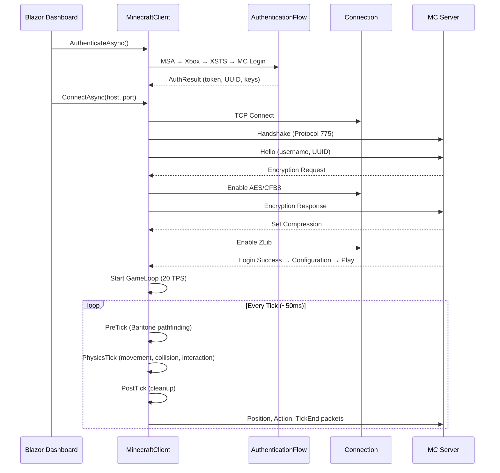
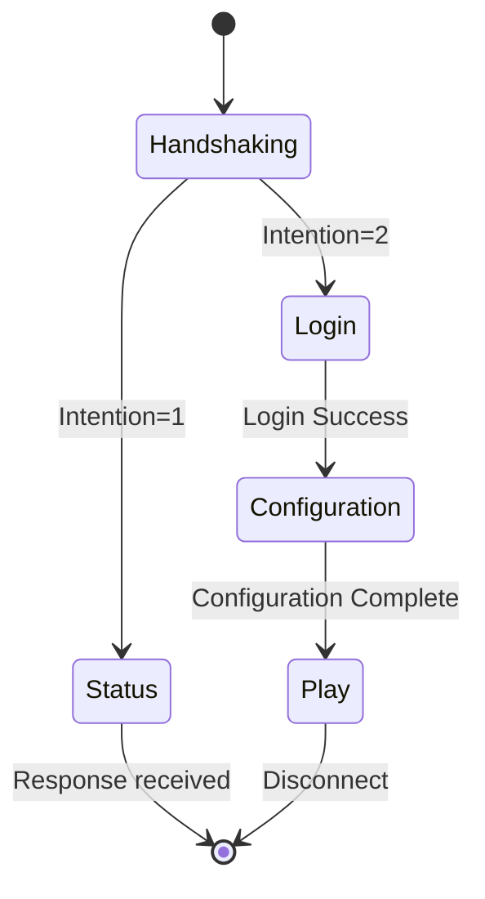
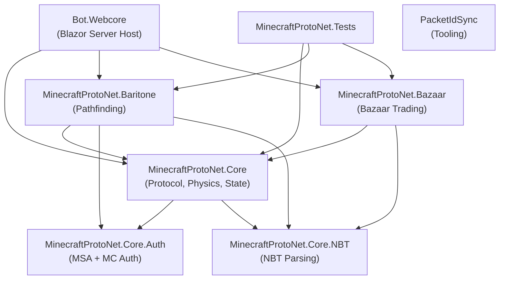

# MinecraftProtoNet

A fully autonomous **Minecraft bot framework** built in **.NET 10 / C# 14**, implementing the Minecraft protocol from scratch. MinecraftProtoNet can authenticate with Microsoft accounts, connect to vanilla/modded servers, execute physics-accurate movement, navigate the world via A\* pathfinding, and autonomously trade on Hypixel SkyBlock's Bazaar — all managed through a real-time **Blazor Server** dashboard.

---

## ✨ Features

| Area | Highlights |
|---|---|
| **Protocol** | Full Minecraft **1.21.x** (Protocol 775) implementation with support for snapshots |
| **Authentication** | Complete MSA → Xbox Live → XSTS → Minecraft Services OAuth chain with token caching & chat-session signing |
| **Networking** | TCP connection, **AES/CFB8** encryption (BouncyCastle), **ZLib** compression, VarInt framing |
| **Physics** | Vanilla-accurate physics engine — AABB collision, gravity, sprinting, sneaking, swimming, and more |
| **Pathfinding** | C# port of **Baritone** — A\* pathfinding with movement costs, block-breaking/placing, jump/sprint movements |
| **Trading** | Autonomous **Hypixel SkyBlock Bazaar** trading engine with order management & safety controls |
| **Anti-Detection** | *Humanizer* system — tick jitter, rotation smoothing, randomized GUI interaction delays, idle look-around |
| **Dashboard** | Real-time **Blazor Server** web UI for monitoring, controlling, and interacting with the bot |
| **Commands** | Extensible chat-command system with attribute-based auto-registration and per-player authorization |
| **NBT** | Full Named Binary Tag (NBT) reader for item/block data parsing |

---

## 🗂️ Solution Structure

```
MinecraftProtoNet.slnx
│
├── MinecraftProtoNet.Core           # Core protocol, networking, state, physics, services
│   ├── Core/                        #   MinecraftClient, Connection, ProtocolConstants
│   ├── Packets/                     #   Packet definitions (Handshaking, Login, Status, Configuration, Play)
│   ├── Handlers/                    #   Packet handlers per protocol state
│   ├── Services/                    #   GameLoop, PhysicsService, PacketRegistry, Inventory/Container mgmt
│   ├── State/                       #   Entity, Level, ChunkManager, PlayerRegistry, WorldBorder
│   ├── Actions/                     #   InteractionManager (block place/dig, entity interaction)
│   ├── Commands/                    #   Chat command framework (ICommand, CommandRegistry)
│   ├── Physics/                     #   Collision shapes, block shape registry, AABB math
│   ├── Configuration/               #   HumanizerConfig and options binding
│   └── Abstractions/                #   IChatSink, IHumanizer, handler/service interfaces
│
├── MinecraftProtoNet.Core.Auth      # Microsoft + Minecraft authentication
│   ├── Authenticators/              #   MicrosoftAuthenticator, XboxAuthenticator, MinecraftAuthenticator
│   ├── Managers/                    #   PlayerKeyManager (chat-session profile keys)
│   └── Dtos/                        #   AuthResult, token response models
│
├── MinecraftProtoNet.Core.NBT       # Named Binary Tag parsing
│   ├── Tags/                        #   Tag types (Compound, List, String, Int, etc.)
│   ├── NbtReader.cs                 #   Binary stream reader
│   └── NbtExtensions.cs             #   Helper extensions
│
├── MinecraftProtoNet.Baritone       # Pathfinding & autonomous movement (Baritone port)
│   ├── Pathfinding/                 #   A* path calculation, movement types, goals
│   ├── Behaviors/                   #   PathingBehavior, LookBehavior, InventoryBehavior
│   ├── Process/                     #   High-level process management
│   ├── Cache/                       #   World cache for pathfinding lookups
│   └── Commands/                    #   !goto, !follow, !stop, etc.
│
├── MinecraftProtoNet.Bazaar         # Autonomous Hypixel SkyBlock Bazaar trading
│   ├── Engine/                      #   BazaarTradingEngine, TradingState machine
│   ├── Api/                         #   Bazaar companion API client (Refit)
│   ├── Orders/                      #   Order lifecycle management
│   ├── Safety/                      #   Risk controls and guards
│   ├── Gui/                         #   Automated NPC / sign interaction
│   └── Commands/                    #   !bazaar chat commands
│
├── Bot.Webcore                      # Blazor Server dashboard (host application)
│   ├── Components/                  #   Razor pages & layout
│   ├── Services/                    #   BotService, DragDropState
│   └── Program.cs                   #   App entry point, DI composition root
│
├── MinecraftProtoNet.Tests          # xUnit + FluentAssertions + Moq test suite
│
└── Tools/
    └── PacketIdSync                 # Tooling for syncing packet IDs across protocol versions
```

---

## 🔧 Tech Stack

| Category | Technologies |
|---|---|
| **Runtime** | .NET 10, C# 14 |
| **Web UI** | Blazor Server (Interactive SSR) |
| **Auth** | MSAL (`Microsoft.Identity.Client`) with token caching |
| **Crypto** | BouncyCastle (AES/CFB8 encryption) |
| **HTTP** | Refit (typed REST clients for Xbox/Minecraft/Bazaar APIs) |
| **Logging** | Serilog (Console + File sinks), `ILogger<T>` |
| **CLI** | Spectre.Console |
| **Text** | Humanizer.Core |
| **Testing** | xUnit, FluentAssertions, Moq, Coverlet |

---

## 🏗️ Architecture Overview

### Connection Lifecycle



### Protocol State Machine



### Game Loop

The `GameLoop` runs on a dedicated background thread at the server's tick rate (default 20 TPS / 50ms). Each tick:

1. **Pre-Tick** — External systems hook in (e.g., Baritone calculates next movement input)
2. **Physics Tick** — Vanilla-accurate physics: carried-item sync → right/left click handling → collision detection → position update → server packet emission
3. **Post-Tick** — Cleanup and state sync
4. **Tick End** — `ClientTickEndPacket` sent to server
5. **Sleep** — Remaining time + humanizer jitter

---

## 🚀 Getting Started

### Prerequisites

- [.NET 10 SDK](https://dotnet.microsoft.com/download)
- A **Microsoft account** that owns Minecraft: Java Edition

### Build & Run

```bash
# Clone the repository
git clone <repo-url>
cd MinecraftProtoNet

# Restore and build
dotnet build

# Run the Blazor dashboard
dotnet run --project Bot.Webcore
```

The dashboard will be available at `http://localhost:5107`.

### Configuration

Edit `Bot.Webcore/appsettings.json` to configure:

```jsonc
{
  "BazaarTrading": {
    "BazaarCompanionBaseUrl": "https://bazaar.amosr.uk",
    "BazaarCompanionApiKey": ""          // Your API key
  },
  "Humanizer": {
    "Enabled": false,                    // Enable anti-detection behaviors
    "ForceOnRemote": true,               // Auto-enable on non-local servers
    "LocalNetworks": ["127.0.0.1", "localhost"],
    "TickJitterMinMs": -1,               // Tick timing randomization
    "TickJitterMaxMs": 3,
    "RotationJitterMaxDegrees": 0.04,    // Subtle head movement noise
    "GuiClickMinMs": 100,               // GUI interaction delays
    "GuiClickMaxMs": 350,
    "BlockExternalCommandsOnRemote": true,
    "AuthorizedPlayerUuids": ["<uuid>"]  // Players allowed to send ! commands
  }
}
```

> [!TIP]
> Use `dotnet user-secrets` for the Bazaar API key instead of storing it in `appsettings.json`.

---

## 💬 Chat Commands

Commands are triggered in-game via chat messages prefixed with `!`. The system uses **attribute-based auto-registration** — commands are discovered at startup from all loaded assemblies.

| Command | Module | Description |
|---|---|---|
| `!goto <x> <y> <z>` | Baritone | Pathfind to coordinates |
| `!follow <player>` | Baritone | Follow a player |
| `!stop` | Baritone | Cancel current pathfinding |
| `!bazaar` | Bazaar | Bazaar trading controls |

Commands from external players are **blocked on remote servers** by default unless their UUID is in the `AuthorizedPlayerUuids` list.

---

## 🧭 Baritone Pathfinding

A faithful **C# port of Baritone**, the popular Minecraft pathfinding mod:

- **A\* Search** over a 3D block graph with movement cost heuristics
- **Movement types**: Walk, Sprint, Jump, Ascend, Descend, Diagonal, Pillar, Parkour, WalkOff
- **Behaviors**: `PathingBehavior` (path execution), `LookBehavior` (head rotation), `InventoryBehavior` (tool selection)
- **Goals**: `GoalBlock`, `GoalXZ`, `GoalNear`, `GoalGetToBlock`, and more
- **World Cache**: Efficient block-state lookups for the pathfinder
- Integrates with the game loop via `PreTick` / `PostTick` hooks

---

## 📈 Bazaar Trading

Fully autonomous trading on the **Hypixel SkyBlock Bazaar**:

- **Trading Engine** — State machine managing the full buy/sell lifecycle
- **Order Management** — Order placement, tracking, and cancellation
- **Safety Controls** — Guards against overspending, rate limits, and market manipulation
- **GUI Automation** — Interacts with NPC dialogs and sign-based input
- **Companion API** — External price/strategy data via a Refit HTTP client

---

## 🛡️ Humanizer (Anti-Detection)

The Humanizer system simulates human-like behavior to reduce detection risk on public servers:

| Behavior | Description |
|---|---|
| **Tick Jitter** | Randomizes game loop timing by ±1–3ms |
| **Rotation Noise** | Adds subtle sub-degree noise to head movements |
| **GUI Delays** | Randomized click (100–350ms) and navigation (250–900ms) timing |
| **Chat Delays** | Human-like typing speed for chat commands (500–1800ms) |
| **Idle Behavior** | Periodic random look-around when idle |
| **Remote Detection** | Auto-enables on non-local servers |

---

## 🔐 Authentication

Implements the complete Minecraft authentication chain:

```
Microsoft Account (MSAL with device-code / interactive)
    → Xbox Live Token
        → XSTS Token
            → Minecraft Services Access Token
                → Minecraft Profile (UUID + Username)
                    → Player Profile Keys (chat signing)
```

- **Token caching** via MSAL extensions (survives restarts)
- **Chat session signing** with RSA keys for secure chat (`ChatSessionUpdatePacket`)
- **Player key management** with Mojang-signed key pairs

---

## 🧪 Testing

```bash
dotnet test
```

- **Framework**: xUnit
- **Assertions**: FluentAssertions
- **Mocking**: Moq
- **Coverage**: Coverlet
- Test projects cover Core, Baritone, Bazaar, Auth, and NBT modules

---

## 📦 Project Dependency Graph



---

## 📄 License

*This project is private and not publicly licensed.*
